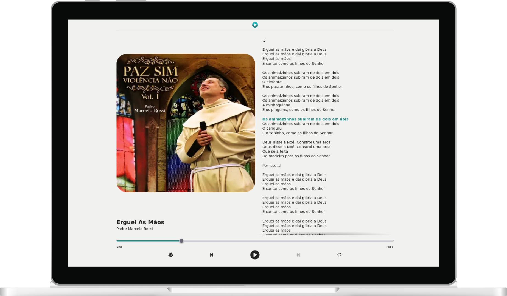
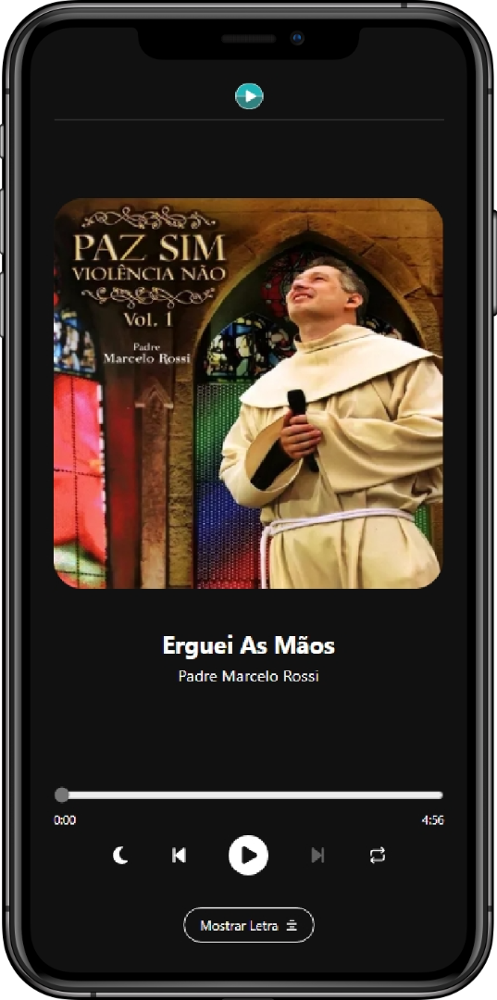

<h1>
    <p align=center>
        
    </p>
    <p align=center>Music Player</p>
</h1>

<p align=center>
    <a href='https://music-player-acelerazg.vercel.app/'>music-player-acelerazg.vercel.app</a>
    <br/><br/>
    
    &nbsp;
    
    &nbsp;
    
</p>

&nbsp;

<p align=center>
    
    &nbsp;&nbsp;&nbsp;&nbsp;
    
</p>

&nbsp;

## 💡 Motivation

The main idea of the project is to display the entire lyrics of the music "Erguei As Mãos" from Pr. Marcelo Rossi.

It was created as part of the "Acelera ZG" selection process.

&nbsp;

## ✨ Additional Features

- [x] 📜 Live lyrics
- [x] 👤 User-friendly interface
- [x] 📱 Responsive layout
- [x] 🌙 Light/Dark mode

&nbsp;

## 🖥️ Running the project

Clone the repository

```bash
git clone https://github.com/gabriel-dp/Music-Player.git
```

Install the dependencies

```bash
npm install
```

Run locally

```bash
npm run dev
```
